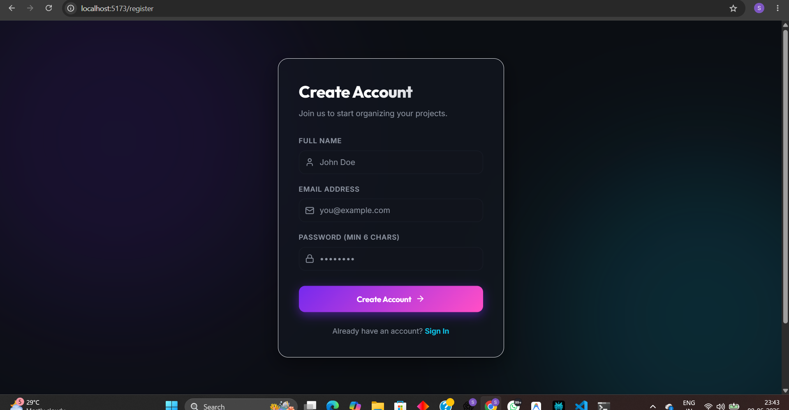
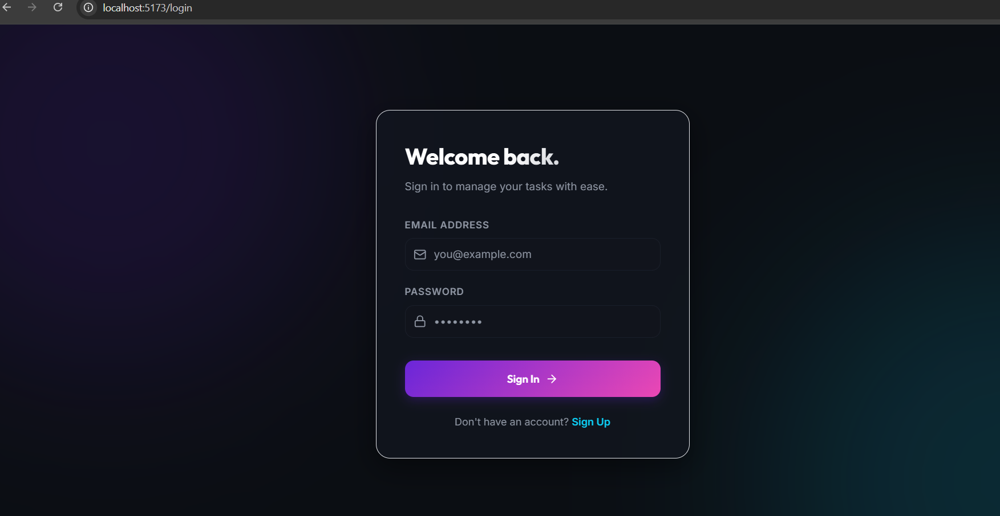
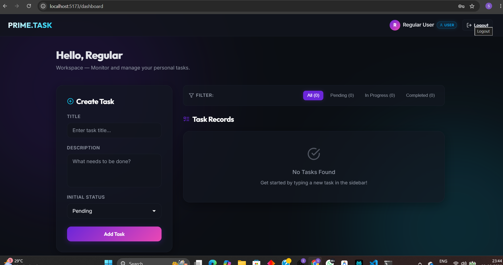
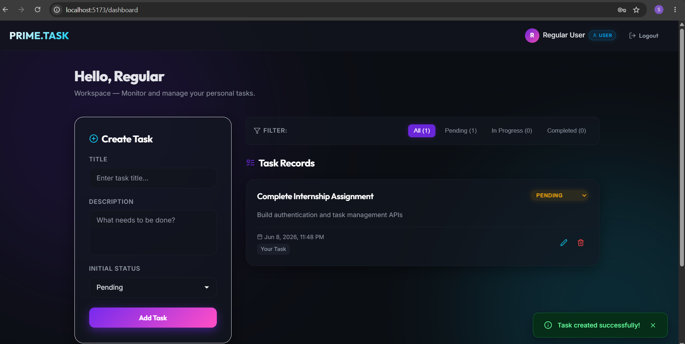
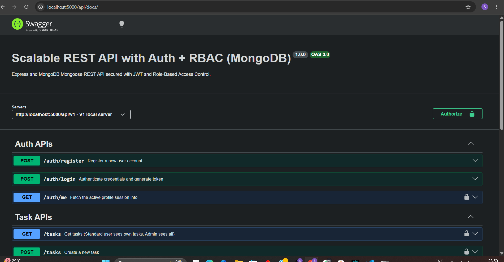

# PrimeTask - Scalable REST API with Auth & Role-Based Access Control (MongoDB)

A clean, production-ready, full-stack task management application featuring a Node.js + Express backend powered by MongoDB and Mongoose, paired with a React.js (Vite) frontend. The application utilizes JSON Web Tokens (JWT) and Role-Based Access Control (RBAC) to gate endpoints.

---

## 🚀 Features

### 1. Authentication & Security
- **Secure Password Hashing**: Utilizes `bcryptjs` for encryption during registration.
- **Stateless Sessions**: JWT generation on login and registration, stored securely client-side.
- **Route Protection**: JWT authentication verification middleware blocks unauthenticated requests.
- **Centralized Validation**: Comprehensive request validation schemas using `express-validator`.
- **API Guarding**: Security headers enabled via `helmet` and CORS configurations.

### 2. Role-Based Access Control (RBAC)
- **Roles**: `user` and `admin`.
- **Permissions**:
  - `user` accounts can perform complete CRUD actions on tasks they created.
  - `admin` accounts can view all users, view all tasks, and manage any task in the system.

### 3. Task Management Module
- Fields: `title`, `description`, `status` (`pending`, `in-progress`, `completed`), `createdBy` (User ObjectId reference), and `createdAt`.

### 4. Interactive Swagger Documentation
- Complete OpenAPI 3.0.0 interactive playground served at `/api/docs`.

### 5. Frontend Client
- Fast React application scaffolded using Vite.
- Custom HSL dark theme with glassmorphic cards, glowing borders, custom typography (**Outfit** and **Inter**), and micro-animations.
- Axios wrapper with request/response interceptors to attach tokens and handle `401` redirects automatically.

---

## 📁 Folder Structure

```
Paladi_Sindhu_Backend_Assignment/
│
├── backend/
│   ├── src/
│   │   ├── config/          # db.js (Mongoose DB connection + Seeding)
│   │   ├── controllers/     # authController.js, taskController.js, adminController.js
│   │   ├── middleware/      # authMiddleware.js, roleMiddleware.js, errorMiddleware.js
│   │   ├── models/          # User.js, Task.js (Mongoose Schemas)
│   │   ├── routes/          # authRoutes.js, taskRoutes.js, adminRoutes.js
│   │   ├── validators/      # authValidator.js, taskValidator.js
│   │   ├── docs/            # swagger.js (OpenAPI specs)
│   │   └── utils/           # apiResponse.js, appError.js
│   ├── app.js               # Express application initialization
│   ├── server.js            # Server launcher entrypoint
│   ├── .env.example
│   └── package.json
│
├── frontend/
│   ├── src/
│   │   ├── components/      # ProtectedRoute.jsx, Navbar.jsx, TaskCard.jsx
│   │   ├── context/         # AuthContext.jsx (Global user session hook)
│   │   ├── pages/           # Login.jsx, Register.jsx, Dashboard.jsx
│   │   ├── routes/          # AppRoutes.jsx (Client route mapping)
│   │   ├── services/        # api.js (Axios API client)
│   │   ├── App.css
│   │   ├── index.css        # Core custom variables and visual styles
│   │   └── App.jsx
│   ├── vite.config.js
│   └── package.json
│
├── README.md
└── SCALABILITY.md
```

---

## ⚙️ Environment Variables

### Backend (`/backend/.env`)

```ini
PORT=5000
MONGODB_URI=mongodb://127.0.0.1:27017/internship_db
JWT_SECRET=super_secret_jwt_token_for_internship_assignment_123456
NODE_ENV=development
```

### Frontend (`/frontend/.env` - Optional)

```ini
VITE_API_URL=http://localhost:5000/api/v1
```

---

## 💻 How to Run Locally

### 1. Database Requirement
Ensure you have a local MongoDB instance running at `mongodb://127.0.0.1:27017/` (or configure your own Atlas URI inside the `.env` file).

### 2. Boot the Backend Server

```bash
cd backend
npm install
npm run dev
```
*The database check will run, initialize the collections, and pre-seed two test accounts if the DB is empty.*

#### 🔑 Pre-seeded test credentials:
- **Admin**: `admin@example.com` / `adminpassword`
- **User**: `user@example.com` / `userpassword`

### 3. Boot the Frontend Client

```bash
cd ../frontend
npm install
npm run dev
```
*Vite will boot the client at `http://localhost:5173`. Open this URL in your web browser.*

---

## Database Schema

### Users Collection
| Field      | Type     | Notes                        |
|------------|----------|------------------------------|
| _id        | ObjectId | Auto-generated               |
| name       | String   | Required                     |
| email      | String   | Unique, required             |
| password   | String   | bcrypt hashed, hidden by default |
| role       | String   | enum: ['user', 'admin'], default: 'user' |
| createdAt  | Date     | Auto timestamp               |

### Tasks Collection
| Field       | Type     | Notes                            |
|-------------|----------|----------------------------------|
| _id         | ObjectId | Auto-generated                   |
| title       | String   | Required                         |
| description | String   | Optional                         |
| status      | String   | enum: ['pending','in-progress','completed'] |
| createdBy   | ObjectId | Ref → Users collection           |
| createdAt   | Date     | Auto timestamp                   |

## 📋 API Endpoints Summary (Prefix: `/api/v1`)

### Auth Endpoints
- `POST /auth/register` — Register a new user.
- `POST /auth/login` — Login to receive JWT token.
- `GET /auth/me` — Fetch logged-in user profile (JWT required).

### Task Endpoints
- `GET /tasks` — Get all tasks (User sees own tasks, Admin sees all).
- `POST /tasks` — Create a new task.
- `GET /tasks/:id` — Get a single task (Owner or Admin).
- `PUT /tasks/:id` — Update a task (Owner or Admin).
- `DELETE /tasks/:id` — Delete a task (Owner or Admin).

### Admin Endpoints
- `GET /admin/users` — Fetch all users in the system (Admin only).
- `GET /admin/tasks` — Fetch all tasks in the system (Admin only).

---

## 📖 Swagger Documentation Usage
When the backend server is running, navigate to:
```
http://localhost:5000/api/docs
```
Here, you can inspect schemas, parameters, and use the **"Try it out"** button to execute HTTP requests directly against the server. Make sure to authenticate by clicking the **"Authorize"** button and entering your bearer token.

---

## 📸 Screenshots Section
## Screenshots

### Register Page


### Login Page


### Dashboard


### Create Task


### Swagger Documentation

